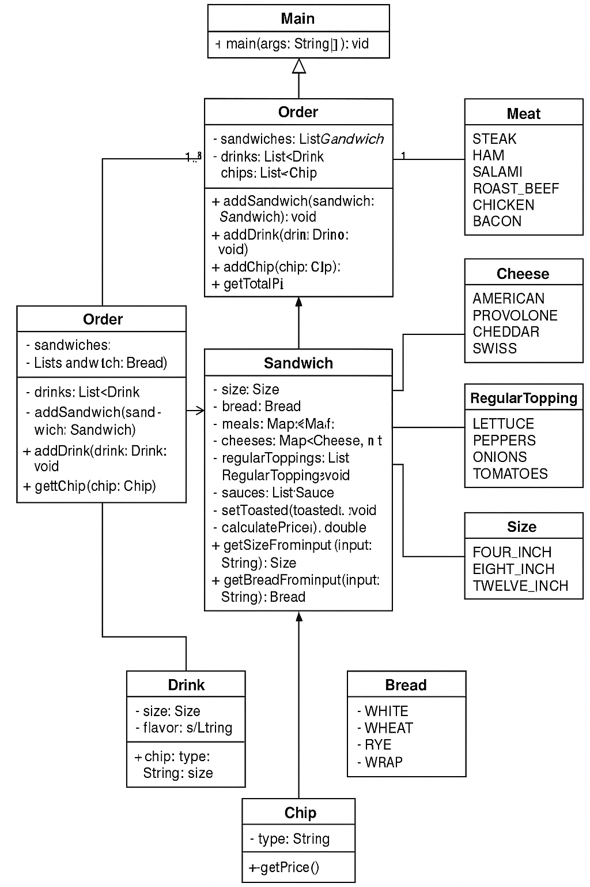
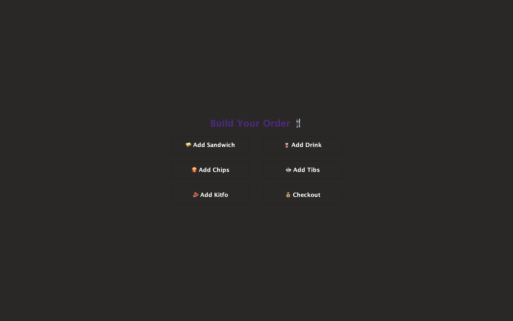
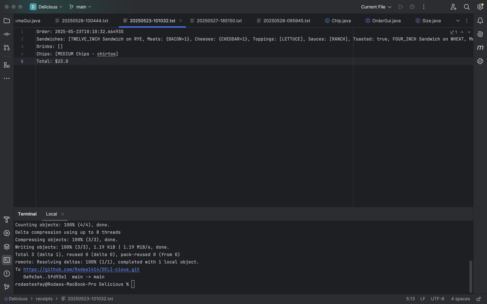
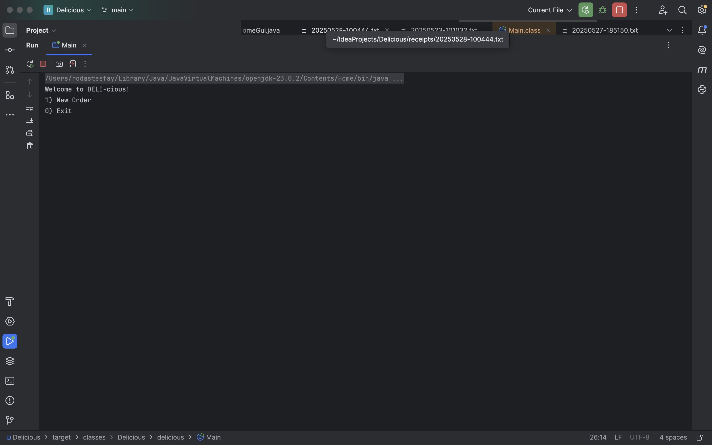
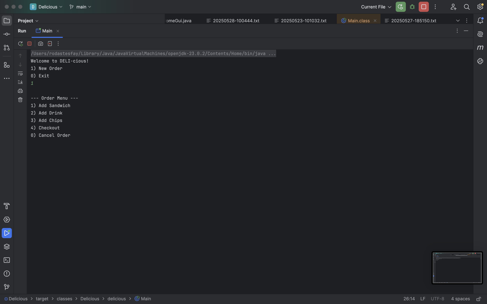
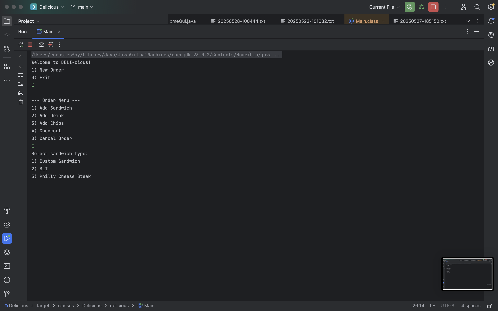
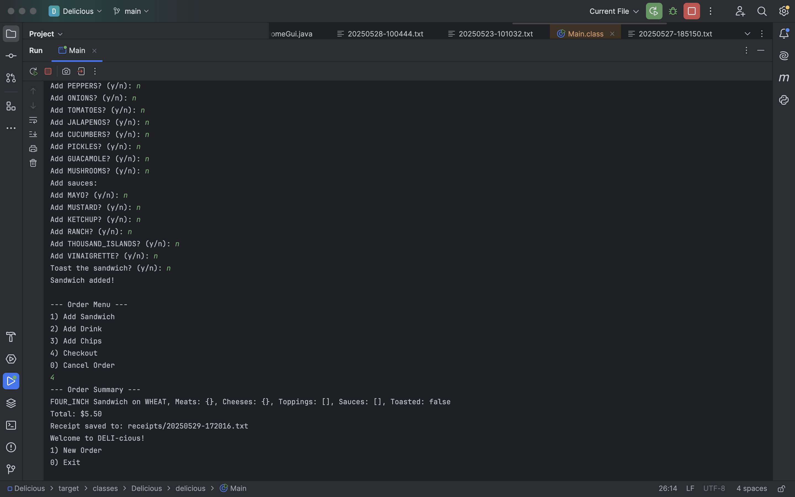
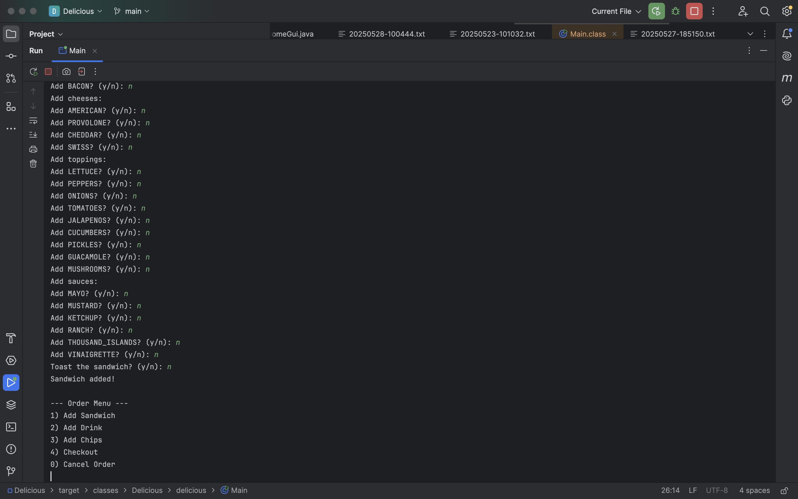

# 🥪 DELI-cious: Custom Sandwich Shop Point-of-Sale System

Welcome to **DELI-cious**, a Java-based Point-of-Sale (POS) application built for a custom sandwich shop experience. This app supports full order creation using a clean Java Swing GUI, detailed UML planning, and receipt generation.

---


---

## 📦 Features

- 🧾 **Order Creation**: Sandwiches, drinks, and chips
- 🧠 **Interactive GUI**: Built using Java Swing
- 📄 **Receipt Generator**: Generates `.txt` files for every order
- 📊 **Well-structured Model**: Follows OOP principles with enums and inheritance
- 📌 **UML Diagram Included**
- ✅ **Unit-tested with JUnit 5**

---


## 🧩 Project Structure

```
/src
  /ui               # Swing user interface
  /mode1           # Core classes (Order, Sandwich, Drink, Chip)
  /mode1/enums      # Size, Bread, Meats, Cheeses, Toppings, Sauces
  /util             # Receipt generator
/test               # Unit tests
```

---

## 🛠 How to Run

1. Clone this repo
2. Open in IntelliJ or Eclipse
3. Run `HomeGUI.java` to start the app

```bash
javac delicious/ui/HomeGUI.java
java delicious.ui.HomeGUI
```

---


## ✨ Screenshots

> 
> 
> 
> 
> 
> 
> 
> 

---

## 🧑‍💻 Author

**Rodas Gebreyohannes**  
:)
